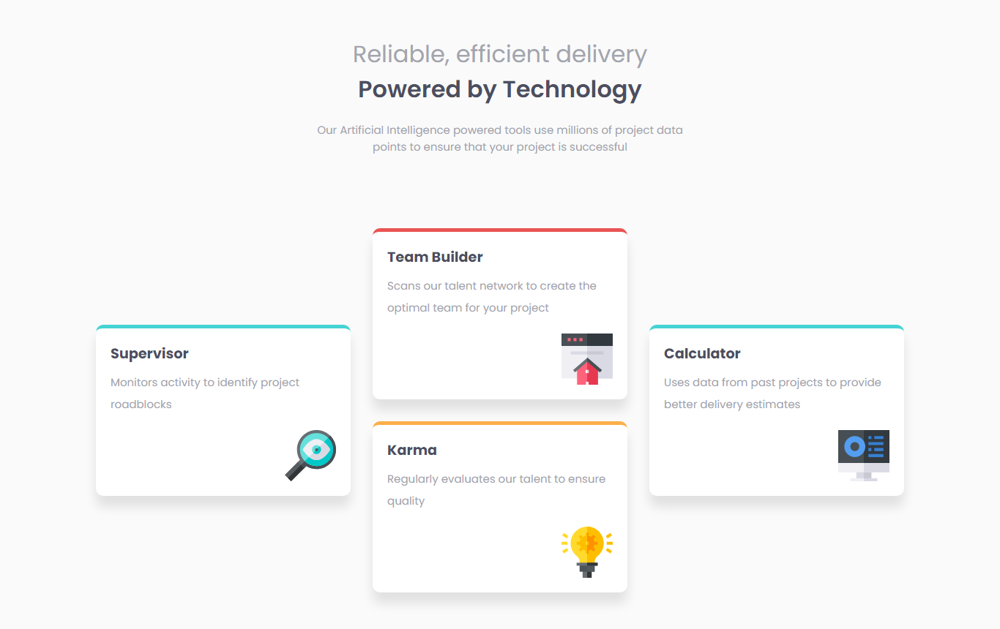
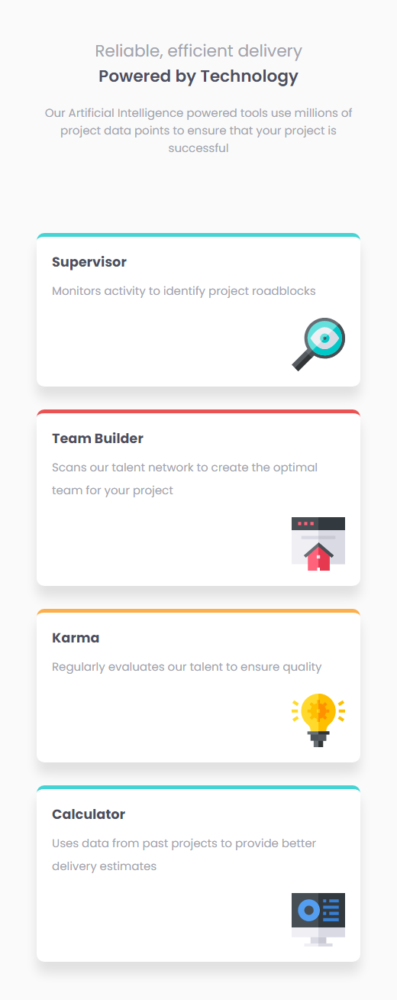

# Frontend Mentor - Four card feature section solution

This is a solution to the [Four card feature section challenge on Frontend Mentor](https://www.frontendmentor.io/challenges/four-card-feature-section-weK1eFYK). Frontend Mentor challenges help you improve your coding skills by building realistic projects. 

## Table of contents

- [Overview](#overview)
  - [The challenge](#the-challenge)
  - [Screenshot](#screenshot)
  - [Links](#links)
- [My process](#my-process)
  - [Built with](#built-with)
  - [What I learned](#what-i-learned)
  - [Continued development](#continued-development)
  - [Useful resources](#useful-resources)
- [Author](#author)
- [Acknowledgments](#acknowledgments)


## Overview

### The challenge

Users should be able to:

- View the optimal layout for the site depending on their device's screen size

### Screenshot

Desktop View



Mobile View




### Links

- Solution URL: [Github Repo](https://github.com/GentryHQ/four-cards-features-section)
- Live Site URL: [Github Pages](https://gentryhq.github.io/four-cards-features-section/)

## My process

### Built with

- Semantic HTML5 markup
- CSS custom properties
- Flexbox
- CSS Grid
- Mobile-first workflow
- [Animate On Scroll Library](https://michalsnik.github.io/aos/) - For Animation


### What I learned

- I'm really proud of how my positioning skills has grown in CSS, I will love to play with other layout more until I become comfortable with using CSS grid.

- I learnt how to use the animate on scroll library for animation.


### Continued development

I'd love to explore more animation in the future. I'll like to try out more libraries like GSAP and I'd love to build some from scratch too.


### Useful resources

- [Animate On Scroll Github Repo](https://github.com/michalsnik/aos) - Check this out if you want to see how AOS works.


## Author

- Website - [Gentry.com.ng](https://www.gentry.com.ng)
- Frontend Mentor - [@GentryHQ](https://www.frontendmentor.io/profile/GentryHQ)
- Twitter - [@iam_gentry](https://www.twitter.com/iam_gentry)


## Acknowledgments

``` **Thank You!** ```
